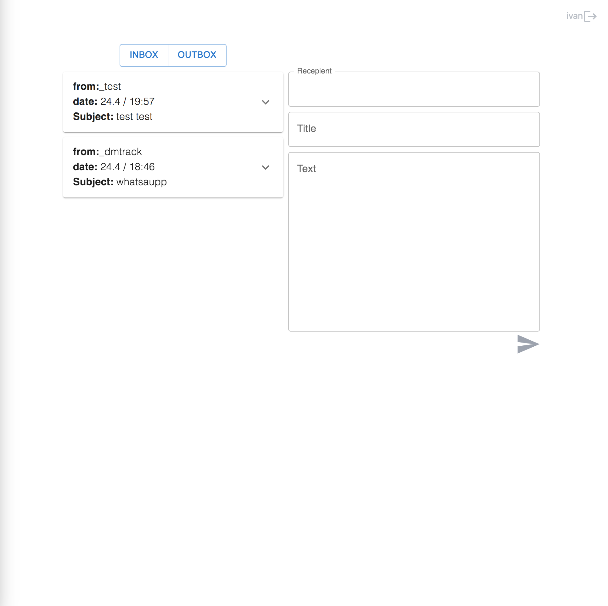
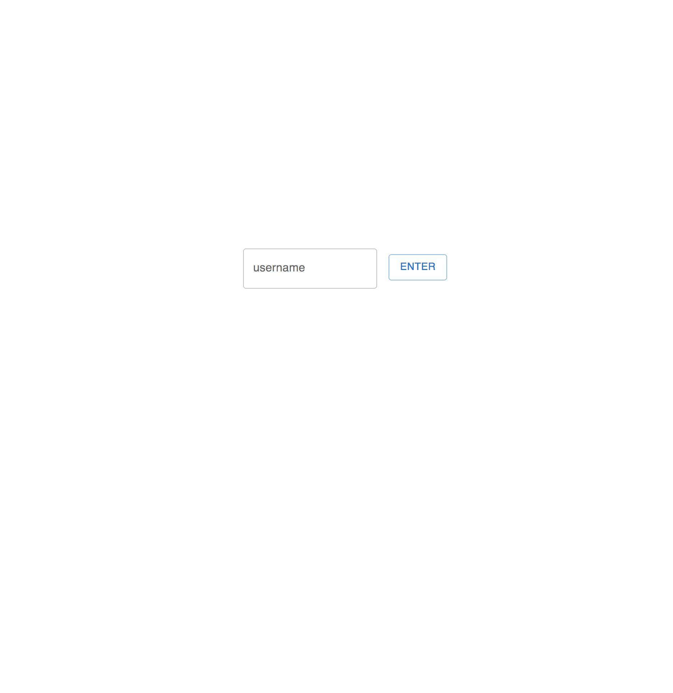

## email-client

[Link to the deploy](https://email-client4.onrender.com)

[Link to the backend repository](https://github.com/project2devdmtrack/email_client-server/tree/master)

### Description

This project is one of the iTransition's internship tasks.

### Features

You can send email-messages via socket technology
You can choose recepients requested directly from
All data is stored in sql-db

### Stack

-   TypeScript
-   React
-   Bootstrap UI
-   node.js
-   express
-   socket-IO
-   postgreSQL (ORM: Sequalize)

### Preview

